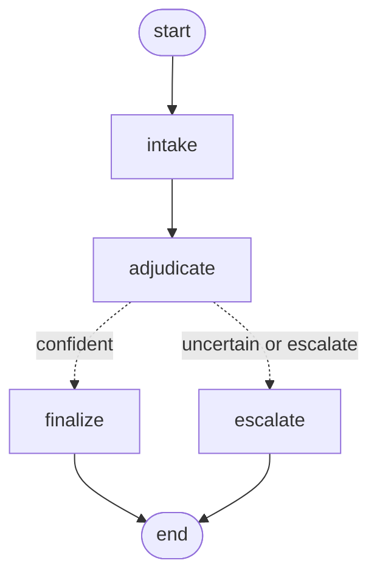

# dispute-adjudication-agent

A lightweight AI-assisted dispute adjudication workflow: **LangGraph** orchestrates the flow, **Jev** (TypeSafe's decision-only model) acts as the structured judgment layer, and **Langfuse** provides full observability into every step.

Given a dispute narrative, the agent asks Jev two typed questions — *what's the verdict?* and *how severe is this?* — and uses Jev's calibrated confidence to decide whether to auto-resolve the dispute or route it to a human adjudicator.

> All sample data in this repo is synthetic (fictional stores, products, and amounts) — there is no real customer or transaction data anywhere in this codebase.

## Why Jev instead of a general-purpose LLM

Jev doesn't generate text — it takes a piece of state plus a set of typed questions (a closed choice, or a rubric score) and returns a typed answer with a calibrated probability per option. That's what makes confidence-gated routing possible: the agent only auto-resolves when Jev's own probability distribution is actually decisive, not when a model merely *sounds* confident. See [agent/jev.py](agent/jev.py).

## Architecture



- **`intake`** — validates the case type, normalizes the narrative.
- **`adjudicate`** — calls Jev for a verdict (`refund` / `deny` / `escalate`) and a severity score, each with calibrated confidence.
- **`route_on_confidence`** — if the verdict is `escalate`, or confidence is below `0.75` ([agent/graph.py](agent/graph.py)), routes to a human; otherwise auto-resolves.
- **`finalize` / `escalate`** — terminal nodes that set the final status.

Every node is traced in Langfuse automatically (via LangGraph's callback integration); the Jev call itself is additionally instrumented as a `generation` observation (model name, token usage) since it's a raw API call the integration can't see on its own. PII (card numbers, emails) is redacted before anything is sent to Langfuse. See [agent/runner.py](agent/runner.py).

## Case types (v1 scope)

This first version is deliberately scoped to four common e-commerce/payment dispute categories rather than open-ended free text classification, so Jev's criteria can be tailored to what actually matters for each one. See [agent/case_types.py](agent/case_types.py) for the full criteria and synthetic sample dispute per type.

| Case type | What Jev weighs |
|---|---|
| Item not received | Shipment tracking status, time since promised delivery, seller responsiveness |
| Item damaged | Photo evidence, how soon it was reported, shipping- vs. pre-existing damage |
| Item not as described | How specific/verifiable the discrepancy is, listing ambiguity |
| Refund not received | Time since refund was supposedly issued, proof a refund was actually initiated |

## Project structure

```
agent/
  state.py        # DisputeState TypedDict, CaseType enum
  case_types.py    # the 4 case types: Jev criteria + synthetic sample disputes
  jev.py           # Jev (TypeSafe) client wrapper, instrumented as a Langfuse generation
  graph.py         # LangGraph StateGraph: intake -> adjudicate -> finalize | escalate
  runner.py        # shared entry point: tracing, PII masking, used by all 3 front ends
main.py            # CLI demo — runs all 4 case types
api.py             # FastAPI service (POST /disputes, GET /case-types)
streamlit_app.py   # Streamlit UI with a case-type picker
```

## Setup

```bash
python3 -m venv .venv
source .venv/bin/activate
pip install -r requirements.txt

cp .env.example .env
# fill in TYPESAFE_API_KEY (required) — get one at https://console.typesafe.ai/settings/keys
# optionally fill in LANGFUSE_PUBLIC_KEY / LANGFUSE_SECRET_KEY for tracing
# — free account at https://cloud.langfuse.com
```

## Running

```bash
# CLI demo — runs one synthetic dispute per case type
python main.py

# Streamlit UI — pick a case type, edit the narrative, see the verdict
streamlit run streamlit_app.py

# FastAPI service
uvicorn api:app --reload
curl -X POST localhost:8000/disputes -H 'content-type: application/json' \
    -d '{"case_type": "item_not_received", "dispute_text": "..."}'
```

### Example output

```
=== Item not received (item_not_received) ===
Verdict:       refund
Confidence:    0.95
Probabilities: {'deny': 0.0, 'refund': 0.97, 'escalate': 0.03}
Severity:      1.44
Status:        auto_resolved

=== Refund not received (refund_not_received) ===
Verdict:       escalate
Confidence:    0.61
Probabilities: {'escalate': 0.74, 'deny': 0.0, 'refund': 0.26}
Severity:      1.08
Status:        needs_human_review
Notes:         confidence fell below the 0.75 threshold — routed to a human adjudicator.
```

Note the second case: Jev leans toward `escalate` but isn't confident enough (0.61 < 0.75) to auto-resolve on that alone — exactly the behavior confidence-gated routing is meant to produce. Full probabilities and reasoning context are visible per-step in Langfuse when tracing is configured.

## Tech stack

- [LangGraph](https://github.com/langchain-ai/langgraph) — agent orchestration
- [Jev / TypeSafe](https://docs.typesafe.ai) — typed, calibrated decision model
- [Langfuse](https://langfuse.com) — tracing, PII masking, cost/token observability
- [FastAPI](https://fastapi.tiangolo.com) + [Streamlit](https://streamlit.io) — two front ends over the same agent

## License

MIT — see [LICENSE](LICENSE).
